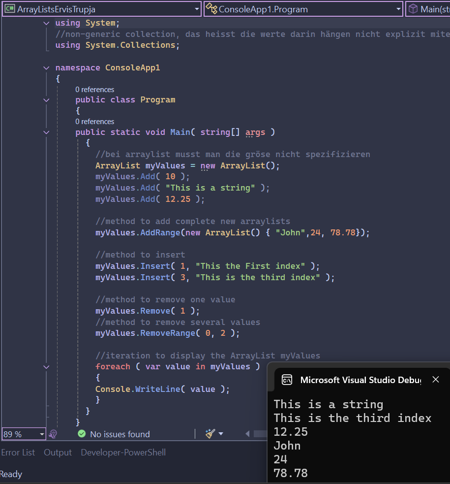

# ArrayLists in C# – Example Project

This project demonstrates how to use `ArrayList` in C# to store, add, insert, and remove various data types. It also shows how to iterate through the elements using a `foreach` loop.

## 📸 Screenshot

